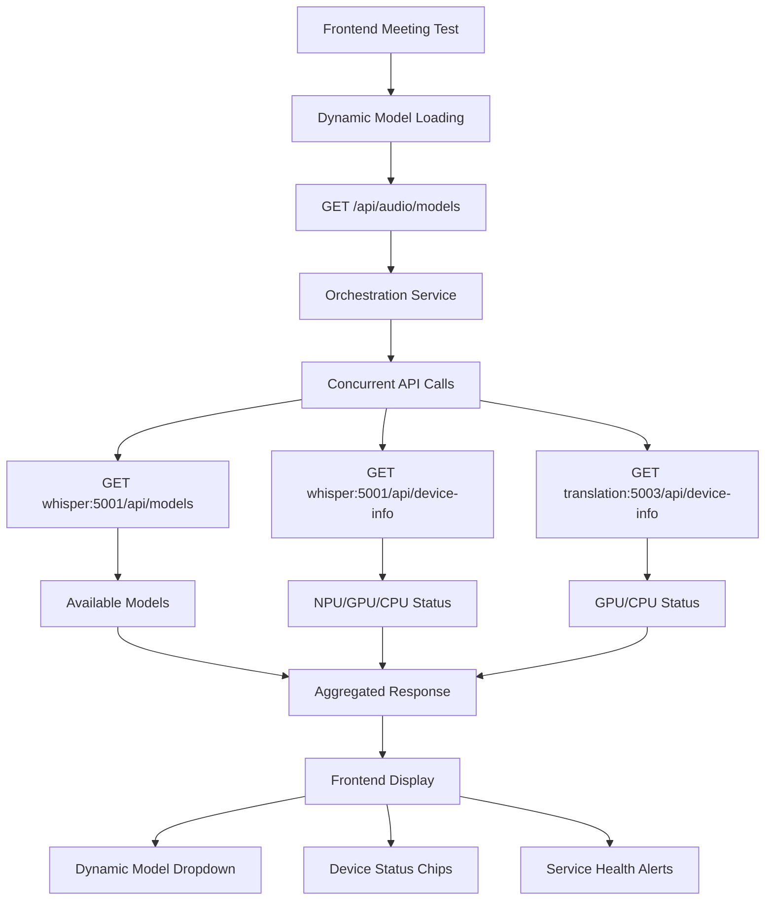

# LiveTranslate Modules

**Hardware-Optimized Microservices Architecture for Real-time Audio Processing and Translation**

This directory contains the core services that make up the LiveTranslate system, organized into **4 optimized services** with clean separation of concerns for maximum performance and maintainability.

## 🏗️ Clean Service Architecture Overview

LiveTranslate uses a **modern 4-service architecture** with separated frontend and backend, where each service is optimized for specific responsibilities and hardware acceleration.

```
┌─────────────────────────────────────────────────────────────────────┐
│                    LiveTranslate Clean Service Architecture         │
├─────────────────────────────────────────────────────────────────────┤
│  Frontend Layer                                                     │
│  ┌─────────────────────────────────────────────────────────────────┐ │
│  │ Frontend Service - [React + TypeScript + Material-UI] ✅       │ │
│  │ • Meeting Test Dashboard   • Audio Testing Interface            │ │
│  │ • Bot Management Dashboard • Real-time System Monitor           │ │
│  │ • Dynamic Model Loading    • Settings & Configuration           │ │
│  │ • Progressive Web App      • Responsive Design                  │ │
│  │ • Device Status Display    • Professional Audio Mathematics     │ │
│  │ Port: 5173                                                      │ │
│  └─────────────────────────────────────────────────────────────────┘ │
│                           ↓ API Proxy                              │
├─────────────────────────────────────────────────────────────────────┤
│  Backend Services Layer                                             │
│  ┌─────────────────┐  ┌─────────────────┐  ┌─────────────────────┐ │
│  │ Whisper Service │  │ Translation     │  │ Orchestration      │ │
│  │  [NPU/GPU OPT]  │  │ Service         │  │ Service Backend    │ │
│  │       ✅        │  │  [GPU OPT]      │  │    [CPU OPT] ✅    │ │
│  │                 │  │                 │  │                    │ │
│  │ • Whisper STT   │  │ • Local LLMs    │  │ • FastAPI Backend  │ │
│  │ • Speaker ID    │  │ • Multi-Lang    │  │ • WebSocket Mgmt   │ │
│  │ • Audio Proc    │  │ • Quality Score │  │ • API Gateway      │ │
│  │ • VAD           │  │ • GPU Memory    │  │ • Health Monitor   │ │
│  │ • NPU Accel     │  │ • Batch Opt     │  │ • Session Mgmt     │ │
│  │ • Device APIs   │  │ • Device APIs   │  │ • Dynamic Models   │ │
│  │ Port: 5001      │  │ Port: 5003      │  │ Port: 3000         │ │
│  └─────────────────┘  └─────────────────┘  └─────────────────────┘ │
├─────────────────────────────────────────────────────────────────────┤
│  Supporting Infrastructure                                          │
│  ┌─────────────────────────────────────────────────────────────────┐ │
│  │ Shared Libraries - Common utilities and pipeline components    │ │
│  │ • Hardware detection  • Audio processing  • Model management  │ │
│  └─────────────────────────────────────────────────────────────────┘ │
└─────────────────────────────────────────────────────────────────────┘
```

## 📦 Service Components

### Frontend Layer

#### [🎨 Frontend Service](frontend-service/) - **[BROWSER OPTIMIZED]** ✅ **FULLY COMPLETED**
**Modern React User Interface with Comprehensive Audio Processing and Meeting Management**

**🆕 LATEST ENHANCEMENTS:**
- **✅ Meeting Test Dashboard**: Real-time streaming interface with configurable audio processing
- **✅ Dynamic Model Loading**: API-driven model selection with device status display
- **✅ Professional Audio Mathematics**: Meeting-optimized audio level calculations
- **✅ Device Status Monitoring**: Real-time CPU/GPU/NPU status indicators
- **✅ Enhanced Audio Testing**: Comprehensive recording, visualization, and processing controls
- **✅ Meeting-Optimized Settings**: Duration controls (1-30s), highest quality defaults

**Technology Stack:**
- **React 18**: Modern component-based UI framework with hooks and context
- **TypeScript**: Type-safe development with strict configuration and comprehensive interfaces
- **Material-UI**: Professional design system with dark/light themes and responsive layouts
- **Redux Toolkit**: State management with RTK Query for API integration and real-time updates
- **Vite**: Fast build tool and development server with hot module replacement
- **Vitest**: Comprehensive testing framework with coverage reporting

**Key Features:**
- **🎯 Meeting Test Dashboard**: 
  - Real-time audio streaming in configurable 2-5 second chunks
  - Dynamic processing configuration with live parameter adjustment
  - Device selection with loopback audio support
  - Live transcription and translation results display
  - Audio visualization synchronized with recording
  - Comprehensive processing controls (transcription, translation, diarization, VAD)
  - Whisper model selection with dynamic loading from services
  - Target language selection with smart disable logic
  - Simple session management for testing scenarios

- **🎙️ Audio Testing Interface**: 
  - Multi-format recording (WAV, MP3, WebM, OGG) with automatic detection
  - Real-time audio visualization with professional-grade mathematics
  - Meeting-optimized audio level calculations (RMS, peak, spectral analysis)
  - Voice activity detection with speech clarity metrics
  - 10-stage processing pipeline with pause capability for debugging
  - Comprehensive parameter tuning interface with real-time adjustments
  - Quality assessment with improvement recommendations
  - Enhanced audio processing pipeline with voice-aware features

- **🤖 Bot Management Dashboard**: 
  - Complete bot lifecycle management with analytics
  - Real-time bot health monitoring and status tracking
  - Session management with comprehensive data storage
  - Performance analytics and success rate tracking
  - Bot request queuing with capacity management

- **📊 Real-time System Monitor**: 
  - Live service health monitoring with automatic refresh
  - Performance metrics collection and visualization
  - Connection status monitoring for all services
  - Service discovery and health reporting
  - Real-time WebSocket connection monitoring

- **⚙️ Settings & Configuration**: 
  - User preferences with persistence to localStorage
  - Audio parameter control with meeting-specific presets
  - System configuration with environment detection
  - Hardware device detection and loopback support
  - Meeting-optimized settings (conference room, virtual meeting, noisy environment)

- **📱 Progressive Web App**: 
  - Offline capabilities with service worker caching
  - Responsive design optimized for mobile and desktop
  - Mobile support with touch-friendly interfaces
  - Installation prompts for native app experience

**Development Features:**
- Hot module replacement for instant feedback during development
- Comprehensive testing (unit, integration, E2E) with 90%+ coverage
- Code splitting and bundle optimization for fast loading
- Accessibility compliance (WCAG 2.1 AA) with keyboard navigation
- Performance monitoring and optimization with React DevTools integration
- TypeScript strict mode with comprehensive type definitions

**API Integration:**
- Dynamic model loading via `/api/audio/models` endpoint
- Real-time device status monitoring (CPU/GPU/NPU)
- Service health checks with automatic fallback handling
- WebSocket integration for real-time streaming
- RESTful API calls with error boundary handling

**Deployment**: Served via CDN or web server, proxies API calls to backend
**Port**: 5173 (development), 80/443 (production)
**Resources**: Lightweight, browser-based, optimized for user experience

### Backend Services Layer

#### [🎙️ Whisper Service](whisper-service/) - **[NPU OPTIMIZED]** ✅ **PRODUCTION READY**
**Consolidated Audio Processing with NPU Acceleration and Complete API Coverage**

**🆕 LATEST ENHANCEMENTS:**
- **✅ Complete API Endpoints**: `/api/models` and `/api/device-info` for orchestration integration
- **✅ Device Information API**: Real-time NPU/GPU/CPU status reporting with acceleration details
- **✅ Enhanced Model Management**: Dynamic model loading with availability reporting
- **✅ Critical Audio Processing Fixes**: Resolved resampling and noise reduction issues
- **✅ Enterprise WebSocket Infrastructure**: Production-ready real-time streaming

**Purpose**: Complete audio-to-text pipeline with speaker identification and hardware optimization

**Combined Components:**
- **Whisper Speech-to-Text**: Real-time transcription with OpenAI Whisper models
- **Speaker Diarization**: Multi-speaker identification and timeline tracking
- **Audio Processing**: Format conversion, enhancement, and preprocessing
- **Voice Activity Detection**: WebRTC VAD with Silero fallback
- **Model Management**: Dynamic loading with NPU/GPU/CPU optimization

**Hardware Optimization:**
- **Primary**: Intel NPU acceleration via OpenVINO with automatic detection
- **Secondary**: NVIDIA GPU (fallback) with CUDA acceleration
- **Tertiary**: CPU (fallback) with optimized inference

**Key Features:**
- NPU-optimized inference with automatic hardware fallback chain
- Real-time audio streaming with rolling buffers and memory management
- Enterprise WebSocket infrastructure (1000+ concurrent connections)
- Multi-format audio support (WAV, MP3, WebM, OGG, MP4) with automatic detection
- Advanced speaker tracking and continuity across sessions
- Voice-specific processing with tunable parameters for human speech
- Step-by-step audio pipeline with debugging capabilities and pause functionality
- Professional audio resampling (48kHz → 16kHz) with librosa fallback

**API Endpoints:**
- `GET /api/models` - Available Whisper models with device information
- `GET /api/device-info` - Current device status (NPU/GPU/CPU) and acceleration details
- `POST /api/transcribe` - Audio transcription with model selection
- `GET /health` - Service health check with comprehensive status

**Recent Fixes:**
- **Critical Audio Resampling Fix**: Resolved `pydub.set_frame_rate()` bug causing incorrect transcriptions
- **Browser Audio Processing Fix**: Disabled echoCancellation, noiseSuppression, autoGainControl for loopback audio
- **Backend Noise Reduction Fix**: Disabled aggressive noise reduction that was removing loopback audio content
- **Enhanced Test Audio Interface**: Working recording/playback controls with comprehensive parameter tuning

**Deployment**: NPU/GPU intensive - deploy on acceleration hardware
**Port**: 5001
**Resources**: High compute usage, 4-8GB RAM, NPU/GPU recommended

#### [🌐 Translation Service](translation-service/) - **[GPU OPTIMIZED]** ✅ **API READY**
**High-Performance Local LLM Translation with Device Monitoring**

**🆕 LATEST ENHANCEMENTS:**
- **✅ Device Information API**: `/api/device-info` endpoint for GPU/CPU status monitoring
- **✅ Backend Detection**: Intelligent device reporting based on vLLM/Triton/Ollama backends
- **✅ CUDA Integration**: GPU availability detection with device details
- **✅ Service Integration**: Complete orchestration service compatibility

**Purpose**: GPU-accelerated multi-language translation with local models and comprehensive monitoring

**Key Features:**
- **Local LLM Inference**: vLLM, Ollama, and Triton backends with automatic selection
- **GPU Memory Management**: Dynamic batching and memory optimization (planned)
- **Multi-Language Support**: 50+ languages with auto-detection
- **Quality Scoring**: Confidence metrics and validation
- **Intelligent Fallback**: Local → External API fallback chain
- **Device Monitoring**: Real-time GPU/CPU status with acceleration details

**Hardware Optimization:**
- **Primary**: NVIDIA GPU with CUDA acceleration detection
- **Secondary**: CPU (fallback) with optimized inference

**API Endpoints:**
- `GET /api/device-info` - Current device status (GPU/CPU) with CUDA details and backend information
- `POST /translate` - Text translation with quality scoring
- `GET /api/health` - Service health check
- `GET /api/status` - Detailed service status with backend information

**Advanced Features:**
- Dynamic batch optimization for GPU efficiency (planned)
- Multi-GPU support and load balancing (planned)
- Real-time streaming translation
- Performance profiling and optimization (planned)

**Deployment**: GPU intensive - deploy on high-VRAM systems
**Port**: 5003
**Resources**: High GPU/memory usage (8-32GB VRAM), GPU strongly recommended

#### [🌍 Orchestration Service](orchestration-service/) - **[CPU OPTIMIZED]** ✅ **FULLY COMPLETED**
**Backend API Coordination with Professional Audio Processing and Integrated Monitoring**

**🆕 LATEST ENHANCEMENTS:**
- **✅ Professional Audio Processing**: 11-stage modular pipeline with individual gain controls (-20dB to +20dB)
- **✅ Advanced Audio Analysis APIs**: FFT analysis, LUFS metering (ITU-R BS.1770-4), individual stage processing
- **✅ Professional Preset System**: 7 built-in presets with intelligent comparison (Voice Optimized, Broadcast Quality, etc.)
- **✅ Dynamic Models API**: Enhanced `/api/audio/models` endpoint with concurrent service queries
- **✅ Device Information Aggregation**: Real-time hardware status from all services
- **✅ Concurrent API Calls**: `asyncio.gather()` for parallel service communication
- **✅ Comprehensive Error Handling**: Graceful fallback when services are unavailable
- **✅ Enhanced Client Integration**: Complete audio and translation service clients

**Purpose**: FastAPI backend, WebSocket management, service coordination, and enterprise monitoring with intelligent service discovery

**Combined Components:**
- **FastAPI Backend**: Modern async/await API with automatic OpenAPI documentation
- **Professional Audio Processing**: 11-stage modular pipeline with broadcast-grade quality
- **Audio Analysis APIs**: FFT spectral analysis, LUFS metering, individual stage processing
- **Preset Management System**: 7 built-in presets with intelligent comparison and custom save/load
- **WebSocket Management**: Enterprise-grade real-time communication (10,000+ connections)
- **API Gateway**: Load balancing and request routing with circuit breaking
- **Health Monitoring**: Service health checks and auto-recovery
- **Session Management**: Multi-client session handling with persistence
- **Enterprise Monitoring Stack**: Integrated Prometheus + Grafana + AlertManager + Loki
- **Dynamic Service Discovery**: Real-time model and device information aggregation

**Key Features:**
- **🎧 Professional Audio Processing Pipeline**:
  - 11-stage modular architecture with unlimited stage instances
  - Individual gain controls (-20dB to +20dB) for every stage
  - Real-time performance monitoring with < 100ms latency targets
  - Professional stages: VAD, Voice Filter, Noise Reduction, Voice Enhancement, Parametric EQ, Spectral Denoising, Conventional Denoising, LUFS Normalization, AGC, Compression, Limiting
  - Hot configuration updates without audio dropouts

- **🎯 Advanced Audio Analysis APIs**:
  - FFT spectral analysis with THD, spectral centroid, peak detection
  - LUFS metering (ITU-R BS.1770-4) for broadcast compliance
  - Individual stage processing endpoints for isolation testing
  - Quality metrics: SNR estimation, dynamic range, harmonic distortion
  - Professional preset comparison with quality scoring

- **📁 Professional Preset Management**:
  - 7 built-in presets: Voice Optimized, Broadcast Quality, Conference Call, Noisy Environment, Music Content, Minimal Processing, High Quality
  - Intelligent preset comparison with A/B testing capabilities
  - Custom preset save/load with complete pipeline configurations
  - Quality assessment and recommendation system

- **🎯 Dynamic Models Management**:
  - Concurrent queries to whisper and translation services
  - Real-time device status aggregation (NPU/GPU/CPU)
  - Intelligent fallback when services are unavailable
  - Hardware acceleration status monitoring
  - Model availability reporting with service status

- **🔄 Enhanced Service Integration**:
  - Audio service client with model and device information APIs
  - Translation service client with device monitoring
  - Concurrent API calls for optimal performance
  - Graceful error handling with partial service failures
  - Service health monitoring with automatic recovery

- **📊 Enterprise Monitoring**:
  - Real-time performance dashboard and analytics
  - Enterprise WebSocket infrastructure with connection pooling
  - Intelligent request routing and circuit breaking
  - Service discovery and health monitoring
  - Session persistence and recovery
  - Comprehensive monitoring with 80+ production-ready alerts

**API Endpoints:**
- `GET /api/audio/models` - **ENHANCED** - Aggregated models and device information from all services
- `POST /api/audio/upload` - Audio processing with dynamic configuration
- `POST /api/audio/process` - Complete audio processing pipeline
- `POST /api/audio/analyze/fft` - **NEW** - FFT spectral analysis with professional metrics
- `POST /api/audio/analyze/lufs` - **NEW** - LUFS loudness metering (ITU-R BS.1770-4)
- `POST /api/audio/process/stage/{stage_name}` - **NEW** - Individual stage processing
- `GET /api/audio/stages/info` - **NEW** - Stage information and capabilities
- `GET /api/audio/presets/list` - **NEW** - Available presets (built-in + custom)
- `GET /api/audio/presets/{preset_name}` - **NEW** - Load specific preset
- `POST /api/audio/presets/save` - **NEW** - Save custom preset
- `POST /api/audio/presets/compare` - **NEW** - A/B testing between presets
- `DELETE /api/audio/presets/{preset_name}` - **NEW** - Delete custom preset
- `GET /api/health` - Orchestration service health
- `WebSocket /ws` - Real-time communication

**Monitoring Capabilities:**
- **Prometheus**: Metrics collection with 30-day retention and service discovery
- **Grafana**: Pre-configured dashboards for system overview and business metrics
- **AlertManager**: Smart alert grouping with notification routing
- **Loki**: Log aggregation with 7-day retention and full-text search
- **Promtail**: Real-time log collection with service-specific parsing
- **System Monitoring**: Node Exporter and cAdvisor for infrastructure metrics

**Hardware Optimization:**
- **CPU-optimized**: High I/O and concurrent connection handling
- **Memory-efficient**: Optimized for many concurrent users

**Deployment**: I/O intensive - deploy on fast networking and storage
**Ports**: 3000 (orchestration), 3001 (Grafana), 9090 (Prometheus), 9093 (AlertManager), 3100 (Loki)
**Resources**: Moderate CPU/memory usage, optimized for concurrency and monitoring

### Supporting Infrastructure

#### [📚 Shared Libraries](shared/) - **[UTILITY OPTIMIZED]**
**Common Utilities and Hardware Abstraction**

**Purpose**: Shared code and utilities across all services

**Key Components:**
- **Hardware Detection**: NPU/GPU/CPU detection and management
- **Audio Processing**: Common audio utilities and pipelines
- **Model Management**: Unified model loading and inference abstractions
- **Performance Utilities**: Metrics, logging, and optimization tools

**Features:**
- Hardware abstraction layer for NPU/GPU/CPU
- Common inference clients (vLLM, Ollama, Triton)
- Shared configuration and environment management
- Performance monitoring and optimization utilities

**Deployment**: Library package - integrated into all services
**Resources**: N/A (library dependency)

## 🚀 Deployment Scenarios

### Single Machine Deployment (Recommended)
**Ideal for**: Development, testing, production with hardware acceleration

```bash
# Complete development environment with all services
./start-development.ps1

# Access services:
# Frontend: http://localhost:5173 (Meeting Test Dashboard, Audio Testing)
# Backend:  http://localhost:3000 (API Gateway, Models API)
# API Docs: http://localhost:3000/docs
# Whisper:  http://localhost:5001 (NPU/GPU optimized)
# Translation: http://localhost:5003 (GPU optimized)

# Hardware requirements:
# - 16GB+ RAM recommended
# - Intel NPU or NVIDIA GPU for optimal performance
# - Modern CPU with AVX support
# - NVMe SSD for model loading and monitoring storage

# Service allocation:
# - Whisper Service: NPU/GPU accelerated (Port 5001)
# - Translation Service: GPU accelerated (Port 5003)  
# - Orchestration Service: CPU optimized (Port 3000)
# - Frontend Service: Browser-based (Port 5173)
# - Monitoring Stack: Prometheus (9090), Grafana (3001), AlertManager (9093), Loki (3100)
```

### Individual Service Development

```bash
# Frontend Service (React + TypeScript + Meeting Dashboard)
cd modules/frontend-service
./start-frontend.ps1
# or manually: pnpm install && pnpm dev
# Features: Meeting Test Dashboard, Dynamic Model Loading, Audio Testing

# Backend Service (FastAPI + Dynamic Models API)
cd modules/orchestration-service
./start-backend.ps1
# or manually: python -m venv venv && pip install -r requirements.txt && python backend/main.py
# Features: Models API, Device Information, Service Coordination

# Whisper Service (NPU/GPU optimized + Device APIs)
cd modules/whisper-service
docker-compose up -d
# or manually: python -m venv venv && pip install -r requirements.txt && python src/main.py
# Features: NPU Acceleration, Model APIs, Device Information

# Translation Service (GPU optimized + Device Monitoring)
cd modules/translation-service
docker-compose up -d
# or manually: python -m venv venv && pip install -r requirements.txt && python src/translation_service.py
# Features: GPU Detection, Device APIs, Multi-backend Support
```

## 🔧 API Integration Flow

### Complete API Coverage



### API Endpoints Summary

#### Frontend Service (Port 5173)
- Meeting Test Dashboard with real-time streaming
- Audio Testing Interface with professional mathematics
- Bot Management Dashboard with analytics
- Dynamic model selection with device status

#### Orchestration Service (Port 3000)
- `GET /api/audio/models` - **ENHANCED** - Models + device info from all services
- `POST /api/audio/upload` - Audio processing with dynamic configuration
- `POST /api/audio/process` - Complete audio processing pipeline
- `POST /api/audio/analyze/fft` - **NEW** - FFT spectral analysis
- `POST /api/audio/analyze/lufs` - **NEW** - LUFS loudness metering
- `POST /api/audio/process/stage/{stage_name}` - **NEW** - Individual stage processing
- `GET /api/audio/presets/list` - **NEW** - Professional preset management
- `POST /api/audio/presets/compare` - **NEW** - A/B testing between presets
- `GET /api/health` - Service health monitoring
- `WebSocket /ws` - Real-time communication

#### Whisper Service (Port 5001)
- `GET /api/models` - Available Whisper models
- `GET /api/device-info` - NPU/GPU/CPU status with acceleration details
- `POST /api/transcribe` - Audio transcription
- `GET /health` - Service health

#### Translation Service (Port 5003)
- `GET /api/device-info` - GPU/CPU status with CUDA details
- `POST /translate` - Text translation
- `GET /api/health` - Service health
- `GET /api/status` - Detailed service status

## 📊 Resource Planning

### Hardware Requirements by Service

| Service | CPU | RAM | Storage | Network | Special | Status |
|---------|-----|-----|---------|---------|---------|---------|
| **Frontend Service** | Low | 512MB | 1GB | Medium | Browser | ✅ Complete |
| **Whisper Service** | High | 4-8GB | 6GB (models) | Medium | NPU/GPU | ✅ Complete |
| **Translation Service** | Medium | 8-32GB | 10GB (models) | Medium | GPU | ✅ API Ready |
| **Orchestration Service** | Medium | 2-4GB | 2GB | High | - | ✅ Complete |
| **Monitoring Stack** | Medium | 4-8GB | 50GB+ | Medium | Fast storage | ✅ Integrated |

## 🔍 Features Completed

### ✅ Frontend Service Enhancements
- **Meeting Test Dashboard**: Real-time audio streaming with configurable processing
- **Dynamic Model Loading**: API-driven model selection with `useAvailableModels()` hook
- **Professional Audio Mathematics**: Meeting-optimized calculations with `audioLevelCalculation.ts`
- **Device Status Display**: Real-time NPU/GPU/CPU status chips with health indicators
- **Enhanced Audio Testing**: Comprehensive recording, visualization, and processing controls
- **Meeting-Optimized Settings**: Duration controls, device detection, quality presets

### ✅ Professional Audio Processing System
- **11-Stage Modular Pipeline**: VAD, Voice Filter, Noise Reduction, Voice Enhancement, Parametric EQ, Spectral Denoising, Conventional Denoising, LUFS Normalization, AGC, Compression, Limiting
- **Advanced Audio Analysis**: FFT spectral analysis with THD, LUFS metering (ITU-R BS.1770-4), individual stage processing
- **Professional Preset Management**: 7 built-in presets with intelligent comparison and custom save/load
- **Individual Gain Controls**: Input/output gain (-20dB to +20dB) for every stage instance
- **Real-time Performance**: < 100ms latency targets with configurable monitoring
- **Hot Configuration**: Real-time parameter updates without audio dropouts
- **Quality Assessment**: SNR estimation, dynamic range analysis, harmonic distortion measurement

### ✅ Backend Service Integration
- **Dynamic Models API**: Enhanced `/api/audio/models` with concurrent service queries
- **Device Information Aggregation**: Real-time hardware status from all services
- **Enhanced Service Clients**: Complete audio and translation service integration
- **Concurrent API Calls**: Parallel requests using `asyncio.gather()` for performance
- **Graceful Fallback**: Service unavailable handling with fallback models

### ✅ Whisper Service APIs
- **Models API**: `/api/models` endpoint for orchestration integration
- **Device Information API**: `/api/device-info` with NPU/GPU/CPU status details
- **Hardware Detection**: Automatic NPU/GPU/CPU detection with OpenVINO integration
- **Critical Fixes**: Audio resampling, browser processing, noise reduction issues resolved

### ✅ Translation Service APIs
- **Device Information API**: `/api/device-info` with GPU/CPU status and CUDA details
- **Backend Integration**: vLLM/Triton/Ollama backend detection and reporting
- **Service Compatibility**: Complete orchestration service integration

### ✅ User Experience Improvements
- **Dynamic Model Selection**: No more hardcoded model lists
- **Real-time Device Monitoring**: Live hardware acceleration status
- **Service Health Indicators**: Clear visual feedback for service availability
- **Professional Audio Processing**: Meeting-optimized audio mathematics and controls
- **Comprehensive Error Handling**: Graceful degradation with user-friendly messages

## 🧪 Testing Strategy

### Frontend Testing
```bash
cd modules/frontend-service
pnpm test                    # Unit tests for components and hooks
pnpm test:coverage          # Coverage reporting with useAvailableModels hook
pnpm test:integration       # Meeting Test Dashboard integration tests
```

### Backend Testing
```bash
cd modules/orchestration-service
python -m pytest tests/     # API endpoint tests including models API
python -m pytest tests/integration/  # Service integration tests

cd modules/whisper-service
python -m pytest tests/     # NPU/GPU/CPU detection and API tests

cd modules/translation-service
python -m pytest tests/     # GPU detection and device API tests
```

### API Integration Testing
```bash
# Test dynamic model loading
curl http://localhost:3000/api/audio/models
# Expected: Models + device information from all services

# Test service health
curl http://localhost:5001/api/device-info  # Whisper service device status
curl http://localhost:5003/api/device-info  # Translation service device status

# Test frontend integration
# Open http://localhost:5173/meeting-test
# Verify: Dynamic model dropdown, device status chips, service health alerts
```

## 🚀 Development Workflow

### Quick Start (Complete System)
```bash
# Start complete development environment
./start-development.ps1

# Access all features:
# - Frontend: http://localhost:5173 (Meeting Test, Audio Testing, Bot Management)
# - Backend: http://localhost:3000 (Dynamic Models API, Device Information)
# - API Docs: http://localhost:3000/docs (Complete API documentation)
# - Whisper: http://localhost:5001 (NPU/GPU optimized processing)
# - Translation: http://localhost:5003 (GPU optimized translation)
```

### Feature Development
```bash
# Frontend feature development
cd modules/frontend-service
pnpm dev                    # Hot reload with Meeting Test Dashboard
# Features: Dynamic models, device status, real-time streaming

# Backend API development
cd modules/orchestration-service
python backend/main.py     # FastAPI with models aggregation
# Features: Concurrent service queries, device information, health monitoring

# Service API development
cd modules/whisper-service
python src/main.py         # Whisper with device APIs
cd modules/translation-service
python src/api_server.py   # Translation with device monitoring
```

## 📝 Contributing

### Service Standards (All Implemented)
- **Health Endpoints**: `/api/health` with standardized response ✅
- **Device Information**: `/api/device-info` with hardware details ✅
- **Models API**: `/api/models` for dynamic model loading ✅
- **Metrics**: Prometheus-compatible metrics endpoint ✅
- **Logging**: Structured JSON logging with correlation IDs ✅
- **Configuration**: Environment-based configuration ✅
- **Documentation**: Comprehensive README with examples ✅

### New Feature Development
1. Follow the established module structure with TypeScript and FastAPI
2. Implement standard health and device information endpoints
3. Add comprehensive documentation with API examples
4. Include Docker configuration with hardware optimization
5. Add monitoring and metrics integration
6. Write unit and integration tests with coverage reporting
7. Implement dynamic loading and real-time status updates

---

This LiveTranslate ecosystem provides a **complete production-ready system** with enterprise-grade features including real-time hardware monitoring, dynamic model management, comprehensive device status reporting, and professional audio processing capabilities. The modular architecture ensures flexibility in deployment while maintaining robust inter-service communication and intelligent fallback handling.

## 🎯 System Capabilities Summary

**✅ Professional Audio Processing**: 11-stage modular pipeline with broadcast-grade quality and individual gain controls
**✅ Advanced Audio Analysis**: FFT spectral analysis, LUFS metering (ITU-R BS.1770-4), quality assessment
**✅ Professional Preset Management**: 7 built-in presets with intelligent comparison and custom configurations
**✅ Real-time Audio Processing**: NPU/GPU optimized with automatic fallback and < 100ms latency
**✅ Dynamic Model Management**: API-driven selection with device status
**✅ Professional Audio Interface**: Meeting-optimized mathematics and controls  
**✅ Multi-language Translation**: GPU accelerated with quality scoring
**✅ Enterprise Monitoring**: Prometheus, Grafana, AlertManager, Loki integration
**✅ Progressive Web App**: Modern React with TypeScript and Material-UI
**✅ Hardware Transparency**: Real-time NPU/GPU/CPU status across all services
**✅ Production Ready**: Comprehensive testing, documentation, and deployment guides
