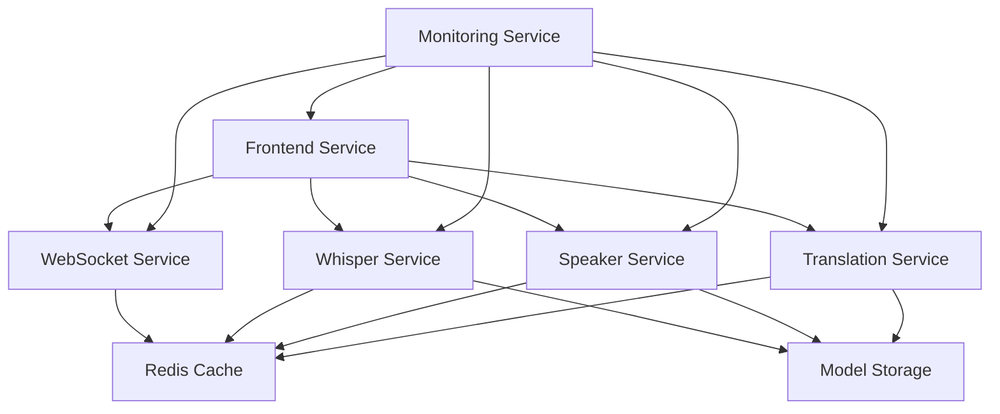

# LiveTranslate Modules

**Hardware-Optimized Microservices Architecture for Real-time Audio Processing and Translation**

This directory contains the core services that make up the LiveTranslate system, organized into **3 hardware-optimized services** for maximum performance and efficient resource utilization.

## 🏗️ Optimized Architecture Overview

LiveTranslate uses a **consolidated 3-service architecture** where each service is optimized for specific hardware acceleration, reducing complexity while maximizing performance.

```
┌─────────────────────────────────────────────────────────────────────┐
│                    LiveTranslate Optimized System                   │
├─────────────────────────────────────────────────────────────────────┤
│  Hardware-Optimized Service Layer                                  │
│  ┌─────────────────┐  ┌─────────────────┐  ┌─────────────────────┐ │
│  │ Audio Service   │  │ Translation     │  │ Orchestration      │ │
│  │  [NPU/GPU OPT]  │  │ Service         │  │ Service            │ │
│  │                 │  │  [GPU OPT]      │  │  [CPU OPT]         │ │
│  │ • Whisper STT   │  │                 │  │                    │ │
│  │ • Speaker ID    │  │ • Local LLMs    │  │ • Frontend UI      │ │
│  │ • Audio Proc    │  │ • Multi-Lang    │  │ • WebSocket Mgmt   │ │
│  │ • VAD           │  │ • Quality Score │  │ • API Gateway      │ │
│  │ • NPU Accel     │  │ • GPU Memory    │  │ • Health Monitor   │ │
│  │                 │  │ • Batch Opt     │  │ • Session Mgmt     │ │
│  │ Port: 5001      │  │ Port: 5003      │  │ Port: 3000         │ │
│  └─────────────────┘  └─────────────────┘  └─────────────────────┘ │
├─────────────────────────────────────────────────────────────────────┤
│  Supporting Infrastructure                                          │
│  ┌─────────────────────────────────────────────────────────────────┐ │
│  │ Shared Libraries - Common utilities and pipeline components    │ │
│  │ • Hardware detection  • Audio processing  • Model management  │ │
│  └─────────────────────────────────────────────────────────────────┘ │
└─────────────────────────────────────────────────────────────────────┘
```

## 📦 Service Components

### Hardware-Optimized Core Services

#### [🎙️ Audio Service](audio-service/) - **[NPU OPTIMIZED]**
**Consolidated Audio Processing with NPU Acceleration**
- **Purpose**: Complete audio-to-text pipeline with speaker identification
- **Combined Components**:
  - **Whisper Speech-to-Text**: Real-time transcription with OpenAI Whisper
  - **Speaker Diarization**: Multi-speaker identification and tracking
  - **Audio Processing**: Format conversion, enhancement, and preprocessing
  - **Voice Activity Detection**: WebRTC VAD with Silero fallback
- **Hardware Optimization**:
  - **Primary**: Intel NPU acceleration via OpenVINO
  - **Secondary**: NVIDIA GPU (fallback)
  - **Tertiary**: CPU (fallback)
- **Key Features**:
  - NPU-optimized inference with automatic fallback
  - Real-time audio streaming with rolling buffers
  - Enterprise WebSocket infrastructure
  - Multi-format audio support with proper resampling (48kHz → 16kHz)
  - Advanced speaker tracking and continuity
  - Voice-specific processing with tunable parameters
  - Step-by-step audio pipeline with debugging capabilities
- **Recent Fixes**:
  - Fixed critical audio resampling bug causing incorrect transcriptions
  - Enhanced test audio interface with comprehensive controls
  - Added voice-aware processing to preserve human speech characteristics
- **Deployment**: NPU/GPU intensive - deploy on acceleration hardware
- **Port**: 5001
- **Resources**: High compute usage, 4-8GB RAM, NPU/GPU recommended

#### [🌐 Translation Service](translation-service/) - **[GPU OPTIMIZED]**
**High-Performance Local LLM Translation**
- **Purpose**: GPU-accelerated multi-language translation with local models
- **Key Features**:
  - **Local LLM Inference**: vLLM, Ollama, and Triton backends
  - **GPU Memory Management**: Dynamic batching and memory optimization
  - **Multi-Language Support**: 50+ languages with auto-detection
  - **Quality Scoring**: Confidence metrics and validation
  - **Intelligent Fallback**: Local → External API fallback chain
- **Hardware Optimization**:
  - **Primary**: NVIDIA GPU with CUDA acceleration
  - **Secondary**: CPU (fallback)
- **Advanced Features**:
  - Dynamic batch optimization for GPU efficiency
  - Multi-GPU support and load balancing
  - Real-time streaming translation
  - Performance profiling and optimization
- **Deployment**: GPU intensive - deploy on high-VRAM systems
- **Port**: 5003
- **Resources**: High GPU/memory usage (8-32GB VRAM), GPU strongly recommended

#### [🌍 Orchestration Service](orchestration-service/) - **[CPU OPTIMIZED]** ✅
**Centralized Service Coordination and Management with Integrated Monitoring**
- **Purpose**: Frontend interface, WebSocket management, service coordination, and enterprise monitoring
- **Combined Components**:
  - **Frontend Interface**: Modern responsive web dashboard with real-time translation
  - **WebSocket Management**: Enterprise-grade real-time communication (10,000+ connections)
  - **API Gateway**: Load balancing and request routing with circuit breaking
  - **Health Monitoring**: Service health checks and auto-recovery
  - **Session Management**: Multi-client session handling with persistence
  - **Enterprise Monitoring Stack**: Integrated Prometheus + Grafana + AlertManager + Loki
- **Key Features**:
  - Real-time performance dashboard and analytics
  - Enterprise WebSocket infrastructure with connection pooling
  - Intelligent request routing and circuit breaking
  - Service discovery and health monitoring
  - Session persistence and recovery
  - Comprehensive monitoring with 80+ production-ready alerts
  - Visual dashboards with Grafana integration
  - Structured log aggregation with Loki
  - Automated deployment with health validation
- **Monitoring Capabilities**:
  - **Prometheus**: Metrics collection with 30-day retention and service discovery
  - **Grafana**: Pre-configured dashboards for system overview and business metrics
  - **AlertManager**: Smart alert grouping with notification routing
  - **Loki**: Log aggregation with 7-day retention and full-text search
  - **Promtail**: Real-time log collection with service-specific parsing
  - **System Monitoring**: Node Exporter and cAdvisor for infrastructure metrics
- **Hardware Optimization**:
  - **CPU-optimized**: High I/O and concurrent connection handling
  - **Memory-efficient**: Optimized for many concurrent users
- **Deployment**: I/O intensive - deploy on fast networking and storage
- **Ports**: 3000 (orchestration), 3001 (Grafana), 9090 (Prometheus), 9093 (AlertManager), 3100 (Loki)
- **Resources**: Moderate CPU/memory usage, optimized for concurrency and monitoring

### Supporting Infrastructure

#### [📚 Shared Libraries](shared/)
**Common Utilities and Hardware Abstraction**
- **Purpose**: Shared code and utilities across all services
- **Key Components**:
  - **Hardware Detection**: NPU/GPU/CPU detection and management
  - **Audio Processing**: Common audio utilities and pipelines
  - **Model Management**: Unified model loading and inference abstractions
  - **Performance Utilities**: Metrics, logging, and optimization tools
- **Features**:
  - Hardware abstraction layer for NPU/GPU/CPU
  - Common inference clients (vLLM, Ollama, Triton)
  - Shared configuration and environment management
  - Performance monitoring and optimization utilities
- **Deployment**: Library package - integrated into all services
- **Resources**: N/A (library dependency)

## 🚀 Deployment Scenarios

### Single Machine Deployment (Recommended)
**Ideal for**: Development, testing, production with hardware acceleration

```bash
# Optimized 3-service deployment with hardware acceleration and monitoring
docker-compose -f docker-compose.optimized.yml up -d

# OR deploy orchestration service with full monitoring stack
cd modules/orchestration-service
docker-compose -f docker-compose.monitoring.yml up -d

# Hardware requirements:
# - 16GB+ RAM recommended
# - Intel NPU or NVIDIA GPU for optimal performance
# - Modern CPU with AVX support
# - NVMe SSD for model loading and monitoring storage

# Service allocation:
# - Audio Service: NPU/GPU accelerated (Port 5001)
# - Translation Service: GPU accelerated (Port 5003)  
# - Orchestration Service: CPU optimized (Port 3000)
# - Monitoring Stack: Prometheus (9090), Grafana (3001), AlertManager (9093), Loki (3100)
```

### Hardware-Specific Deployment
**Ideal for**: Production environments with specialized hardware

#### Scenario 1: NPU + GPU Optimized Machine
```bash
# Ideal hardware: Intel NPU + NVIDIA GPU
# Audio processing on NPU, Translation on GPU, Orchestration on CPU

cd modules/audio-service
docker-compose -f docker-compose.npu.yml up -d      # NPU optimized

cd modules/translation-service  
docker-compose -f docker-compose.gpu.yml up -d      # GPU optimized

cd modules/orchestration-service
docker-compose -f docker-compose.monitoring.yml up -d  # CPU optimized with monitoring
```

#### Scenario 2: Multi-GPU Production Cluster
```bash
# Machine 1: Audio Service (NPU primary, GPU fallback)
DEVICE_PREFERENCE=npu FALLBACK_DEVICE=gpu docker-compose up audio-service

# Machine 2: Translation Service (Multi-GPU)
CUDA_VISIBLE_DEVICES=0,1 VLLM_TENSOR_PARALLEL_SIZE=2 docker-compose up translation-service

# Machine 3: Orchestration Service (CPU + High I/O)
docker-compose up orchestration-service
```

#### Scenario 3: Edge + Cloud Hybrid
```bash
# Edge Node: Local processing (NPU/GPU)
cd modules/audio-service && docker-compose up -d    # Local transcription
cd modules/translation-service && docker-compose up -d    # Local translation

# Cloud Node: Coordination and monitoring
cd modules/orchestration-service && docker-compose -f docker-compose.monitoring.yml up -d   # Central coordination with monitoring
```

### Kubernetes Deployment
**Ideal for**: Enterprise, auto-scaling, high availability

```yaml
# Hardware-aware pod scheduling
apiVersion: apps/v1
kind: Deployment
metadata:
  name: audio-service
spec:
  template:
    spec:
      nodeSelector:
        accelerator: "intel-npu"  # Schedule on NPU nodes
      containers:
      - name: audio-service
        resources:
          requests:
            intel.com/npu: 1

---
apiVersion: apps/v1  
kind: Deployment
metadata:
  name: translation-service
spec:
  template:
    spec:
      nodeSelector:
        accelerator: "nvidia-gpu"  # Schedule on GPU nodes
      containers:
      - name: translation-service
        resources:
          requests:
            nvidia.com/gpu: 1

---
apiVersion: apps/v1
kind: Deployment  
metadata:
  name: orchestration-service
spec:
  template:
    spec:
      nodeSelector:
        workload: "cpu-intensive"  # Schedule on CPU-optimized nodes
```

## 🔧 Inter-Service Communication

### Communication Patterns

#### 1. WebSocket Real-time Streams
```javascript
// Frontend ↔ All Services
// Real-time transcription, translation, speaker updates
// Session management and state synchronization
```

#### 2. HTTP/REST APIs
```bash
# Service discovery and health checks
# Configuration management
# Batch processing requests
# Administrative operations
```

#### 3. Message Queues (Redis)
```yaml
# Asynchronous task processing
# Service coordination
# Session state sharing
# Cache management
```

### Service Dependencies



## ⚙️ Configuration Management

### Environment-based Configuration
Each service supports environment-specific configuration:

```bash
# Development environment
ENVIRONMENT=development
LOG_LEVEL=DEBUG
ENABLE_METRICS=true

# Production environment
ENVIRONMENT=production
LOG_LEVEL=INFO
ENABLE_METRICS=true
MONITORING_ENABLED=true
```

### Service Discovery
Services can discover each other through:

```bash
# Static configuration
WHISPER_SERVICE_URL=http://whisper-host:5001
SPEAKER_SERVICE_URL=http://speaker-host:5002

# Dynamic discovery (Kubernetes)
WHISPER_SERVICE_URL=http://whisper-service.default.svc.cluster.local:5001

# Load balancer endpoints
WHISPER_SERVICE_URL=http://whisper-lb.internal:5001
```

## 📊 Resource Planning

### Hardware Requirements by Service

| Service | CPU | RAM | Storage | Network | Special |
|---------|-----|-----|---------|---------|---------|
| **Audio Service** | High | 4-8GB | 6GB (models) | Medium | NPU/GPU |
| **Translation** | Medium | 8-32GB | 10GB (models) | Medium | GPU optional |
| **Orchestration** | Medium | 2-4GB | 2GB | High | - |
| **Monitoring Stack** | Medium | 4-8GB | 50GB+ | Medium | Fast storage |
| **Prometheus** | Low | 2-4GB | 20GB+ | Medium | Fast storage |
| **Grafana** | Low | 512MB-1GB | 1GB | Medium | - |
| **Loki** | Medium | 1-2GB | 20GB+ | Medium | Fast storage |
| **AlertManager** | Low | 256MB-512MB | 1GB | Medium | - |

### Scaling Recommendations

#### Horizontal Scaling
```yaml
# Multiple instances behind load balancer
# Stateless service design
# Shared session storage (Redis)
# Auto-scaling based on metrics
```

#### Vertical Scaling
```yaml
# Whisper: More GPU memory for larger models
# Translation: More RAM for bigger LLMs
# Speaker: More CPU cores for parallel processing
# Frontend: More connections support
```

## 🔍 Monitoring & Observability

### Health Monitoring
All services provide standardized health endpoints:

```bash
# Individual service health
curl http://service-host:port/api/health

# Aggregated system health
curl http://frontend-host:3000/api/services/health

# Orchestration service monitoring endpoints
curl http://localhost:3000/api/health          # Orchestration service
curl http://localhost:9090/-/healthy           # Prometheus
curl http://localhost:3001/api/health          # Grafana
curl http://localhost:9093/-/healthy           # AlertManager
curl http://localhost:3100/ready               # Loki
```

### Metrics Collection
Prometheus metrics from all services:

```yaml
# Service-specific metrics
whisper_transcription_duration_seconds
speaker_diarization_speakers_detected
translation_requests_total
websocket_connections_active

# Orchestration service metrics
orchestration_sessions_active
api_gateway_requests_total
circuit_breaker_state
health_monitor_status

# System metrics
system_cpu_usage_percent
system_memory_usage_bytes
system_disk_usage_bytes
container_cpu_usage_seconds_total
container_memory_usage_bytes
```

### Distributed Logging
Centralized logging with Loki:

```json
{
  "timestamp": "2024-01-15T10:30:00Z",
  "service": "whisper-service",
  "level": "INFO",
  "message": "Transcription completed",
  "session_id": "uuid-1234",
  "duration": 2.5,
  "model": "whisper-medium.en"
}
```

## 🧪 Testing Strategy

### Unit Testing
Each service includes comprehensive unit tests:

```bash
# Individual service testing
cd modules/whisper-service && python -m pytest tests/unit/
cd modules/speaker-service && python -m pytest tests/unit/
cd modules/translation-service && python -m pytest tests/unit/
```

### Integration Testing
Cross-service integration testing:

```bash
# End-to-end workflow testing

# Service communication testing
python tests/integration/test_service_communication.py
```

### Load Testing
Performance and scalability testing:

```bash
# Individual service load testing
python tests/load/test_whisper_load.py --concurrent=50 --duration=300s

# System-wide load testing
python tests/load/test_system_load.py --clients=100 --duration=600s
```

## 🚀 Development Workflow

### Local Development
```bash
# Start all services for development
docker-compose -f docker-compose.comprehensive.yml up -d

# Work on specific service
cd modules/whisper-service
docker-compose up --build

# Run tests
python -m pytest tests/
```

### Service-Specific Development
```bash
# Each service can be developed independently
# Use mock services for dependencies
# Local configuration for testing
# Hot reload for rapid development
```

### CI/CD Integration
```yaml
# Automated testing pipeline
# Container image building
# Multi-environment deployment
# Health check validation
```

## 📝 Contributing

### Adding New Services
1. Follow the established module structure
2. Implement standard health endpoints
3. Add comprehensive documentation
4. Include Docker configuration
5. Add monitoring and metrics
6. Write unit and integration tests

### Service Standards
- **Health Endpoints**: `/api/health` with standardized response
- **Metrics**: Prometheus-compatible metrics endpoint
- **Logging**: Structured JSON logging with correlation IDs
- **Configuration**: Environment-based configuration
- **Documentation**: Comprehensive README with examples

---

Each service in this ecosystem is designed for production deployment with enterprise-grade features including health monitoring, metrics collection, distributed logging, and horizontal scaling capabilities. The modular architecture ensures flexibility in deployment while maintaining robust inter-service communication and data consistency. 